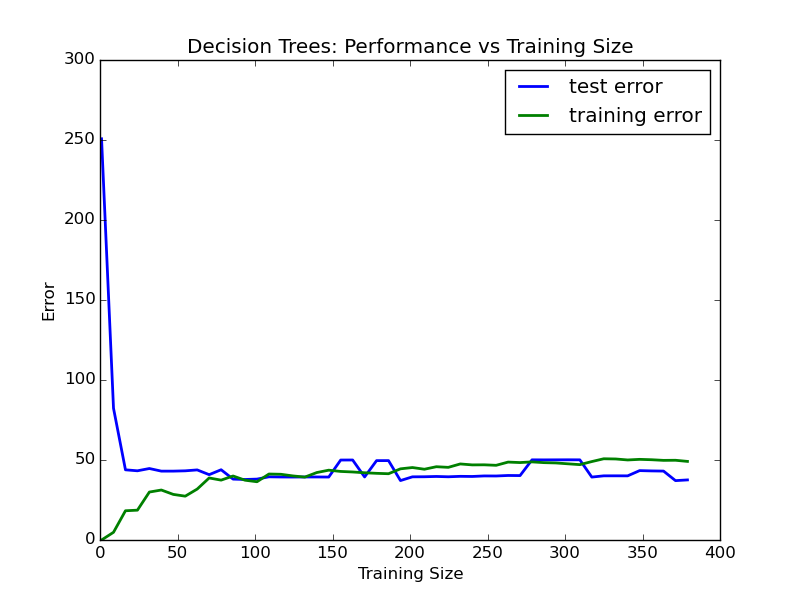
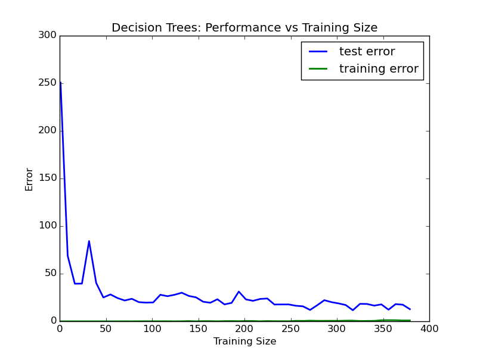
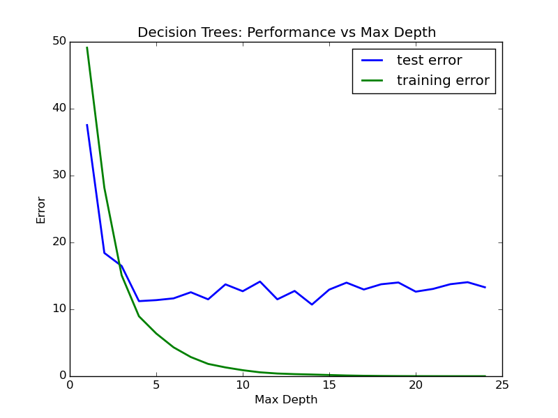

Boston housing prices report
============================

:Author: Jonathan Pelletier

:Email: jpelletier@imperialsys.com

:Date: Sun Nov 22 13:45:44 EST 2015

:Last updated: Wed Nov 25 18:47:40 EST 2015

Data Exploration
----------------

Statistical Analysis
--------------------
:number of data points: 506
:number of features: 13
:minimum housing price: 5.0
:maximum housing price: 50.0
:mean housing price: 22.5328063241
:median housing price: 21.2
:standard deviation: 9.18801154528

Evaluating Model Performance
----------------------------

Performance Metric
~~~~~~~~~~~~~~~~~~~~~~~~~~~~
The *mean squared error* is choosen in order to measure the model performance.
Since this is a *regression supervised learning* problem, other performance 
metrics such as accuracy, precision and recall are not appropriate. Moreover,
the mean squared error is choosen over the other performance metric for 
regression that we have seen in class (mean absolute error) since it penalises
large prediction errors to a greater degree. It is reasonably appropriate, in 
the case of real estate, to believe that large errors are much worst then small 
errors, since they might result in large profit losses.

Testing/Training Split
~~~~~~~~~~~~~~~~~~~~~~
In a nutshell, splitting the data into training and testing sets allows
us to *demonstrate the ability of our model to generalise to yet unseen data 
examples*. 

If we did not split our data into training/testing sets, we could make
the training error arbitrarily small by augmenting the model complexity (e.g:
fitting 10 noisy linear data points with a 57th order polynomial).
However, this model would overfit the data and would make poor prediction with
new training examples.

Grid search
~~~~~~~~~~~
Grid search allows us to optimize parameters that are not directly learned
by the machine learning algorithm. An example parameter that is not directly
learned by the machine learning algorithm could be the degree of the fitting
polynomial in the case of a linear regression. 

Imagine we are trying to find the optimal model complexity (degree) of a
polynomial used to fit some data. We might want to use grid search in order
to find the degree parameter that offers the best trade off between bias error 
and variance error, thus maximizing performance.

Cross validation
~~~~~~~~~~~~~~~~
K-Fold cross validation is the most appropriate cross validation technique
for this regression supervised learning problem. It allows us to use all the
data in our training set to make decisions about the hyperparameters of a model. 
It therefore leads to better models since more data is available for training if
we do not need to create a validation set from the training data.


Analyzing Model Performance
---------------------------

Learning Curves and Training Analysis
~~~~~~~~~~~~~~~~~~~~~~~~~~~~~~~~~~~~~
The *training error* tends to increase slightly as the number of training
example increase. It also converges to a maximum training error value.

The *testing error* tends to decrease as the number of training example 
increase. It also converges to a minimum testing error value.

Both the training error and the testing error converge to the same value.

Learning curves for tree regressors
~~~~~~~~~~~~~~~~~~~~~~~~~~~~~~~~~~~

Max depth 1
```````````


   size-error curve (max_depth = 1)

   ..

When the max depth is 1, the training error and the testing error converge
quickly to a high value. This means that the additional data would not help
the model to perform better and the the error comes from the intrinsic 
inhability of the model to fit the data. In this case, the *bias* error is
dominant and we suffer from *underfitting*. 

Max depth 10
````````````



   size-error curve (max_depth = 10)

   ..

When the max depth is 10, there is a gap between the training error and the 
testing error. The performance of our model varies depending of the dataset
it is beeing trained on and more data could reduce it's error. In this case,
the *variance* error is dominant and we suffer from *overfitting*

Error Curves and Model Complexity
~~~~~~~~~~~~~~~~~~~~~~~~~~~~~~~~~~~~~~~~~~~~~~~~~~~~~~~~~~



   complexity-error curve

   ..


We observe that The training error can be made arbitrarily small by increasing 
the model complexity. This is a manifestation of the fact the complex model
can merely *memorize* the training set. This will not generalize well to yet 
unseen examples.

The testing error decreases for a while, reaches a minimum and increase again.
This is because, at the beginning, the model suffers from underfitting and
bias error is reduced by more complexity. However, when we keep increasing the 
complexity, variance error becomes dominant over the bias error drop and we
see an increase in the overall error

Picking the Optimal Model
~~~~~~~~~~~~~~~~~~~~~~~~~

We want to select the max_depth parameter that *minimises the testing error*. 
From complexity-error curve, this appear to happen for a max_depth parameter of
about 5.

Model prediction
----------------

Predicting housing price
~~~~~~~~~~~~~~~~~~~~~~~~
See the output of the script for the predicted housing price along with the
max_depth parameter choosen by the grid search. Invoke the script as follow:

.. code:: python

 python boston_housing.py

For convinience, sample script output is reproduced here:

.. code:: bash

 Final Model (best estimator): 
 DecisionTreeRegressor(criterion='mse', max_depth=5, max_features=None,
            max_leaf_nodes=None, min_samples_leaf=1, min_samples_split=2,
            min_weight_fraction_leaf=0.0, random_state=None,
            splitter='best')
 House: [11.95, 0.0, 18.1, 0, 0.659, 5.609, 90.0, 1.385, 24, 680.0, 20.2, 332.09, 12.13]
 Prediction: [ 20.96776316]


Comparision of prediction to earlier statistics
~~~~~~~~~~~~~~~~~~~~~~~~~~~~~~~~~~~~~~~~~~~~~~~
The predicted price falls in the min and max range of 5 - 50. It is also very
close to the average house price of 22.58 (withing one standard deviation).

This is sufficient to believe that it is a reasonable housing price.
